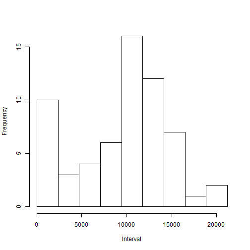
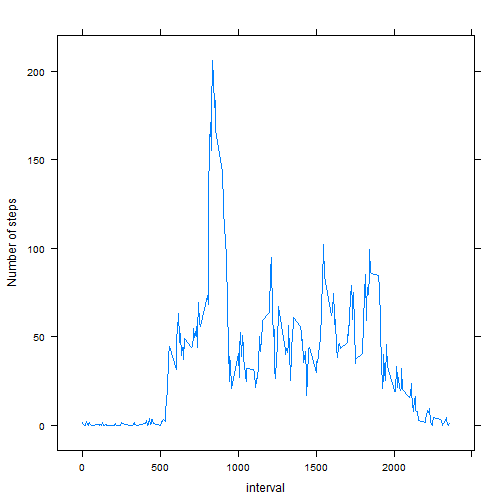
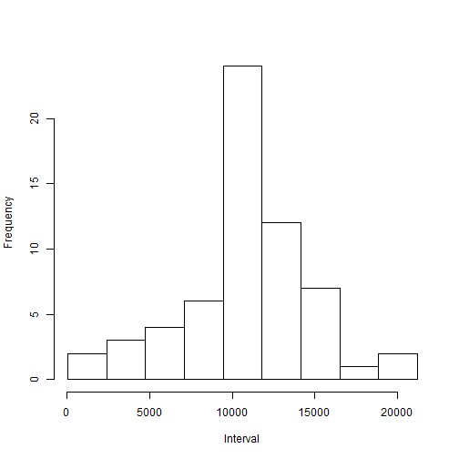

Title- Reproducible Research: Peer Assessment 1
=================================================

Before I am going to give all question answer of Peer Assignment 1, I have requested to all my peers as kindly see Readme file for all details of this Assignment and download required dataset (Activity monitoring data) from Data section who will help to give all answers of question. 

After download repdata-data-activity.zip file (dataset), you must unzip file in your working directory through unzip() finction.  


```r
setwd <- getwd() ## setting working directory
```

Now, I am going to give answer of all questions one by one as asked in Peer Assignment 1.

###*PART 1. Loading and preprocessing the data.*###

**Question 1. Load dataset** 


```r
data1 <- read.csv("Activity.csv")
dim(data1) ## dimension of dataset
```

```
## [1] 17568     3
```

```r
str(data1) ## structure of dataset
```

```
## 'data.frame':	17568 obs. of  3 variables:
##  $ steps   : int  NA NA NA NA NA NA NA NA NA NA ...
##  $ date    : Factor w/ 61 levels "2012-10-01","2012-10-02",..: 1 1 1 1 1 1 1 1 1 1 ...
##  $ interval: int  0 5 10 15 20 25 30 35 40 45 ...
```

```r
head(data1) ## Example as how to look our dataset
```

```
##   steps       date interval
## 1    NA 2012-10-01        0
## 2    NA 2012-10-01        5
## 3    NA 2012-10-01       10
## 4    NA 2012-10-01       15
## 5    NA 2012-10-01       20
## 6    NA 2012-10-01       25
```

###*PART 2. What is mean total number of steps taken per day?*###

**Question 1. Calculate the total number of steps taken per day**


```r
x <- sapply(split(data1$steps, data1$date), sum, na.rm=T)
x1 <- as.data.frame(x)
sum(x1$x)
```

```
## [1] 570608
```

**Question 2. Make a histogram of the total number of steps taken each day**


```r
hist(x1$x, breaks=seq(min(x),max(x),l=9+1), xlab = "Interval", main = "")
```

 

**Question 3. Calculate and report the mean and median of the total number of steps taken per day**


```r
mean(x1$x)
```

```
## [1] 9354.23
```

```r
median(x1$x)
```

```
## [1] 10395
```

###*PART 3. What is the average daily activity pattern?*###

**Question 1. Make a time series plot (i.e. type = "l") of the 5-minute interval (x-axis) and the average number of steps taken, averaged across all days (y-axis)**


```r
library(lattice)
timeplot <- tapply(data1$steps, data1$interval, mean, na.rm=T)
timeplot <- as.data.frame(timeplot)
timeplot$interval <- rownames(timeplot)
row.names(timeplot) <- NULL
names(timeplot) <- c("m_steps", "interval")
timeplot$interval <- as.numeric(timeplot$interval)

xyplot(m_steps~interval, data = timeplot, type="l", ylab="Number of steps")
```

 

**Question 2. Which 5-minute interval, on average across all the days in the dataset, contains the maximum number of steps?**


```r
mx_subset <- subset (timeplot, m_steps==max(timeplot[,"m_steps"]))
mx_subset
```

```
##      m_steps interval
## 104 206.1698      835
```

###*PART 4. Imputing missing values*###

**Question 1. Calculate and report the total number of missing values in the dataset (i.e. the total number of rows with NAs)**


```r
sum(is.na(data1))
```

```
## [1] 2304
```

**Question 2. Devise a strategy for filling in all of the missing values in the dataset. The strategy does not need to be sophisticated.** 

**Answer:** I selected imputed strategy to filling out missing value(NAs) in dataset as the mean for that 5-minute interval.


```r
library(dplyr)
data1 <- data1 %>% mutate(steps = ifelse(is.na(steps), tapply(steps,interval, mean,na.rm=T), steps))
head(data1) ## Example as how to look our dataset after fill missing values
```

```
##       steps       date interval
## 1 1.7169811 2012-10-01        0
## 2 0.3396226 2012-10-01        5
## 3 0.1320755 2012-10-01       10
## 4 0.1509434 2012-10-01       15
## 5 0.0754717 2012-10-01       20
## 6 2.0943396 2012-10-01       25
```

**Question 3.Create a new dataset that is equal to the original dataset but with the missing data filled in.**


```r
fillData <- data1
dim(fillData) ## new dataset that is equal to the original dataset (see dimension)
```

```
## [1] 17568     3
```

```r
head(fillData)
```

```
##       steps       date interval
## 1 1.7169811 2012-10-01        0
## 2 0.3396226 2012-10-01        5
## 3 0.1320755 2012-10-01       10
## 4 0.1509434 2012-10-01       15
## 5 0.0754717 2012-10-01       20
## 6 2.0943396 2012-10-01       25
```

**Question 4.1. Make a histogram of the total number of steps taken each day.**


```r
df <- sapply(split(fillData$steps, fillData$date), sum)
df1 <- as.data.frame(df)

hist(df1$df, breaks=seq(min(df1$df),max(df1$df),l=9+1), xlab = "Interval", main = "")
```

 

**Question 4.2. Calculate and report the mean and median total number of steps taken per day.**


```r
mean(df1$df)
```

```
## [1] 10766.19
```

```r
median(df1$df)
```

```
## [1] 10766.19
```

**Question 4.3. Do these values differ from the estimates from the first part of the assignment?**    

**Answer** : Yes 

**Question 4.4. What is the impact of imputing missing data on the estimates of the total daily number of steps?**


```r
sum(df1$df)
```

```
## [1] 656737.5
```

**Answer** : After imputed missing data, around 86130 (656737.5 - 57608) steps increased in total number of steps per day.   

###*PART 5. Are there differences in activity patterns between weekdays and weekends?*

**Question 1. Create a new factor variable in the dataset with two levels - "weekday" and "weekend" indicating whether a given date is a weekday or weekend day.**


```r
library (lubridate)
fillData$date <- ymd(fillData$date)
fillData$days <- weekdays(fillData$date)
fillData <- mutate(fillData, week = factor(days %in% c("Saturday", "Sunday"), labels = c("weekday", "weekend")))
head(fillData) 
```

```
##       steps       date interval   days    week
## 1 1.7169811 2012-10-01        0 Monday weekday
## 2 0.3396226 2012-10-01        5 Monday weekday
## 3 0.1320755 2012-10-01       10 Monday weekday
## 4 0.1509434 2012-10-01       15 Monday weekday
## 5 0.0754717 2012-10-01       20 Monday weekday
## 6 2.0943396 2012-10-01       25 Monday weekday
```

**Question 2. Make a panel plot containing a time series plot (i.e. type = "l") of the 5-minute interval (x-axis) and the average number of steps taken, averaged across all weekday days or weekend days (y-axis). See the README file in the GitHub repository to see an example of what this plot should look like using simulated data.**


```r
ab <- subset(fillData, week=="weekend") ## subset data according to weekend
ac <- subset(fillData, week=="weekday") ## subset data according to weekday
ab1 <- tapply(ab$steps, ab$interval, mean) ## calculate average steps between weekend
ac1 <- tapply(ac$steps, ac$interval, mean) ## calculate average steps between weekend
finalData <- cbind(ac1, ab1) ## merge two dataset by coloumn
finalData <- as.data.frame(finalData)
finalData$inetrval <- rownames(finalData)
row.names(finalData) <- NULL
names(finalData) <- c("weekday", "weekend", "interval")

library(tidyr)
f1 <- gather(finalData, weekType, count, -interval) ## make tidy dataset 
f1$interval <- as.numeric(f1$interval)

library(lattice)
xyplot(count~interval|weekType, data = f1, layout=c(1,2), type="l", ylab="Number of steps")
```

 


